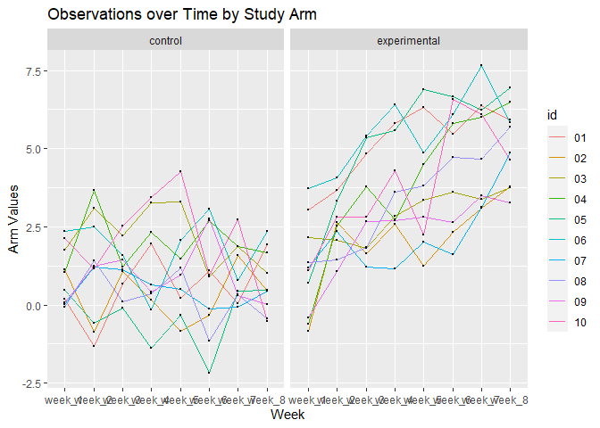

P8105 Homework 5
================
aw3253
11/20/2021

# Problem 1

Describe Raw Data:

``` r
homicide_df=
  read_csv("./data/homicide-data.csv", na=c("", "Unknown")) %>% 
  mutate(
    city_state = str_c(city,state),
    resolution = case_when(
      disposition == "Closed without arrest" ~ "unsolved",
      disposition == "Open/No arrest" ~ "unsolved",
      disposition == "Closed by arrest" ~ "solved"
    )
  ) %>% 
  relocate(city_state) %>% 
  filter(city_state != "TulsaAL")
```

Now focus on Baltimore, MD

``` r
baltimore_df =
  homicide_df %>% 
  filter(city_state == "BaltimoreMD")

baltimore_summary = 
baltimore_df %>% 
  summarize(
    unsolved = sum(resolution == "unsolved"),
    n = n()
  )

baltimore_test =
prop.test(
    x = baltimore_summary %>% pull(unsolved),
    n = baltimore_summary %>%  pull(n))

baltimore_test %>% 
  broom::tidy()
```

    ## # A tibble: 1 x 8
    ##   estimate statistic  p.value parameter conf.low conf.high method    alternative
    ##      <dbl>     <dbl>    <dbl>     <int>    <dbl>     <dbl> <chr>     <chr>      
    ## 1    0.646      239. 6.46e-54         1    0.628     0.663 1-sample~ two.sided

Iteration across cities

``` r
prop_test_function = function(city_df) {
  
  city_summary = 
      city_df %>% 
      summarize(
        unsolved = sum(resolution == "unsolved"),
        n = n()
      )
  city_test =
      prop.test(
        x = city_summary %>% pull(unsolved),
        n = city_summary %>%  pull(n))
  
  return(city_test)
  
}
prop_test_function(baltimore_df)
```

    ## 
    ##  1-sample proportions test with continuity correction
    ## 
    ## data:  city_summary %>% pull(unsolved) out of city_summary %>% pull(n), null probability 0.5
    ## X-squared = 239.01, df = 1, p-value < 2.2e-16
    ## alternative hypothesis: true p is not equal to 0.5
    ## 95 percent confidence interval:
    ##  0.6275625 0.6631599
    ## sample estimates:
    ##         p 
    ## 0.6455607

``` r
homicide_df %>% 
  filter(city_state == "AlbuquerqueNM") %>% 
  prop_test_function()
```

    ## 
    ##  1-sample proportions test with continuity correction
    ## 
    ## data:  city_summary %>% pull(unsolved) out of city_summary %>% pull(n), null probability 0.5
    ## X-squared = 19.114, df = 1, p-value = 1.232e-05
    ## alternative hypothesis: true p is not equal to 0.5
    ## 95 percent confidence interval:
    ##  0.3372604 0.4375766
    ## sample estimates:
    ##         p 
    ## 0.3862434

Iteration across all cities

``` r
results_df =
  homicide_df %>% 
  nest(data = uid:resolution) %>% 
  mutate(
    test_results = map(data, prop_test_function),
    tidy_results = map(test_results, broom::tidy)
  ) %>%  
  select(city_state, tidy_results) %>% 
  unnest(tidy_results) %>% 
  select(city_state, estimate, starts_with("conf"))
```

Plot showing estimates and confidence intervals

``` r
results_df %>% 
  mutate(city_state = fct_reorder(city_state, estimate)) %>% 
  ggplot(aes(x=city_state, y=estimate)) + 
  geom_point() +
  geom_errorbar(aes(ymin = conf.low, ymax = conf.high)) +
  theme(axis.text.x = element_text(angle = 90, vjust = 0.5, hjust=1))
```

<!-- -->

## Problem 2

A dataframe containing all file names:

``` r
file_names_df = 
  files = tibble(list.files("./data/zip_data/"))


file_names_df
```

    ## # A tibble: 20 x 1
    ##    `list.files("./data/zip_data/")`
    ##    <chr>                           
    ##  1 con_01.csv                      
    ##  2 con_02.csv                      
    ##  3 con_03.csv                      
    ##  4 con_04.csv                      
    ##  5 con_05.csv                      
    ##  6 con_06.csv                      
    ##  7 con_07.csv                      
    ##  8 con_08.csv                      
    ##  9 con_09.csv                      
    ## 10 con_10.csv                      
    ## 11 exp_01.csv                      
    ## 12 exp_02.csv                      
    ## 13 exp_03.csv                      
    ## 14 exp_04.csv                      
    ## 15 exp_05.csv                      
    ## 16 exp_06.csv                      
    ## 17 exp_07.csv                      
    ## 18 exp_08.csv                      
    ## 19 exp_09.csv                      
    ## 20 exp_10.csv

Iteration over file names:

``` r
loop_files = function(x) {
  
  data = 
    read_csv(paste0("./data/zip_data/",x)) %>% 
    mutate(file_names = x)
  
}

all_data = map_df(file_names_df, loop_files)
```

    ## Rows: 20 Columns: 8

    ## -- Column specification --------------------------------------------------------
    ## Delimiter: ","
    ## dbl (8): week_1, week_2, week_3, week_4, week_5, week_6, week_7, week_8

    ## 
    ## i Use `spec()` to retrieve the full column specification for this data.
    ## i Specify the column types or set `show_col_types = FALSE` to quiet this message.

Tidying Data:

``` r
new_data = 
  all_data %>% 
  gather(key=week, value = arm_val, week_1:week_8)%>% 
   separate(
    col = file_names,
    into= c("arm","id"),
    sep = "_"
           )  %>% 
  mutate(
    arm = recode(
      arm,
      "con" = "control",
      "exp" = "experimental"
    ),
    id=substr(id,start=1, stop=2), 
  ) 

new_data
```

    ## # A tibble: 160 x 4
    ##    arm     id    week   arm_val
    ##    <chr>   <chr> <chr>    <dbl>
    ##  1 control 01    week_1    0.2 
    ##  2 control 02    week_1    1.13
    ##  3 control 03    week_1    1.77
    ##  4 control 04    week_1    1.04
    ##  5 control 05    week_1    0.47
    ##  6 control 06    week_1    2.37
    ##  7 control 07    week_1    0.03
    ##  8 control 08    week_1   -0.08
    ##  9 control 09    week_1    0.08
    ## 10 control 10    week_1    2.14
    ## # ... with 150 more rows

Spaghetti Plot

``` r
tidy_plot =
ggplot(
  data = new_data, aes(x=week, y=arm_val, group=id))+
  geom_line(aes(color=id)) + 
  geom_point(size=0.5) + 
  facet_grid(. ~ arm) +
  labs(
    title= "Observations over Time by Study Arm",
      x= "Week",
      y= "Arm Values"
    )

tidy_plot
```

<!-- -->

For subjects in the experimental arm, the values increased over time but
for the controls, the values don’t have a distinct trend over time.
While the max arm values for controls is less than 5.0 units, it is much
higher for the experimental subjects.
